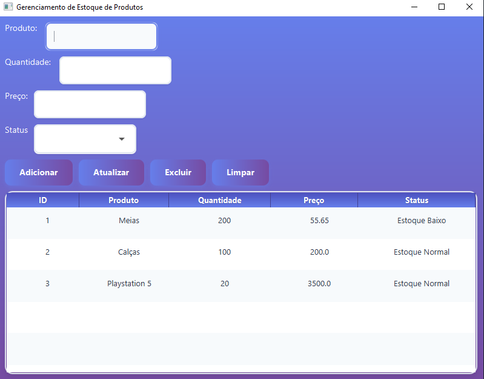
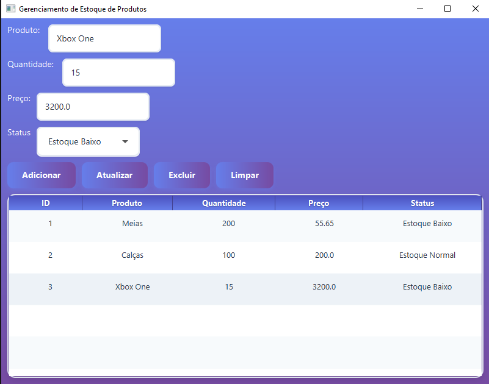
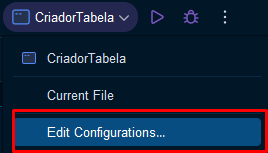

<h1 xmlns="http://www.w3.org/1999/html"> Sistema de Gerenciamento de Produtos - Java + SQLite </h1>

Este projeto é um sistema completo de gerenciamento de produtos com interface gráfica JavaFX e banco de dados SQLite.

<h2> Demonstração do sistema </h2>

<h3> Tela principal </h3>

<h3> Atualizando registro de "Playstation 5" para "Xbox Series S" com o botão atualizar </h3>

<h2> Características Principais </h2>

<ul>
<li> CRUD Completo - Criar, Ler, Atualizar e Excluir produtos </li>
<li> Interface Moderna - Design responsivo e intuitivo </li>
<li> Persistência de Dados - Banco SQLite integrado</li>
<li> UI Profissional - Gradientes, animações e efeitos visuais </li>
<li> Controle de Estoque - Status de estoque normal/baixo </li>
<li> Performance - Operações rápidas e eficientes</li>
</ul>

<table>
    <tr>
        <th> Tecnologia  </th>
        <th> Versão    </th>
        <th> Finalidade </th>
    </tr>
    <tr>
        <td> Java </td>
        <td> 17+    </td>
        <td> Linguagem principal </td>
    </tr>
    <tr>
        <td> JavaFX </td>
        <td>   22.0.1     </td>
        <td>   Interface gráfica </td>
    </tr>
    <tr>
        <td> SQLite </td>
        <td> 3.46.0    </td>
        <td> Banco de dados </td>
    </tr>
    <tr>
        <td>   JDBC  </td>
        <td>   - </td>
        <td>  Conexão com DB  </td>
    </tr>
    <tr>
        <td> CSS3 </td>
        <td> - </td>
        <td>  Estilização da interface  </td>
    </tr>
</table>

<h2> Funcionalidades</h2>

<h3> Visualização de Produtos</h3>
<ul>
<li>Tabela com todos os produtos cadastrados</li>
<li>Colunas: ID, Nome, Quantidade, Preço, Status</li>
<li>Design responsivo com zebrado</li>
</ul>

<h3>Adicionar Produtos</h3>
<ul>
<li>Campos: Nome, Quantidade, Preço, Status</li>
<li>Validação automática de dados</li>
<li>Formatação de preços</li>
</ul>

<h3> Atualizar Produtos</h3>
<ul>
<li>Seleção automática dos campos</li>
<li>Atualização instantânea no banco</li>
<li>Interface intuitiva</li>
</ul>

<h3> Excluir Produtos</h3>
<ul>
<li>Remoção permanente do banco</li>
<li>Confirmação implícita</li>
<li>Atualização em tempo real</li>
</ul>

<h2> Interface (Frontend) </h2> 
A interface gráfica foi desenvolvida em JavaFX com um design moderno e responsivo. O CSS foi otimizado para melhor experiência do usuário com:

<h2>Estrutura do Projeto</h2>
<pre><code>ProjetoJavaJDBC/
├── src/
│   ├── ConexaoDB.java
│   ├── CriadorTabela.java
│   ├── Produto.java
│   ├── ProdutoDAO.java
│   └── ProdutoGUI.java
│   └── styles-produtos.css
├── SQLite Files/
│   └── (arquivos .jar)
└── out/</code></pre>

<h2> Como executar: Compilação e Execução </h2>

Pré-requisitos
- Java JDK 22 ou superior
- JavaFX SDK 22.0.1
- Configure a variável de ambiente:
<pre><code>
set PATH_TO_FX="[SEU_CAMINHO_JAVAFX_SDK]\lib"
</code></pre>

<h3>Clone o repositório:</h3>
<pre><code>git clone https://github.com/seu-usuario/gerenciamento-estoque-javafx.git
cd gerenciamento-estoque-javafx
</code></pre>

<h3>Compilação via terminal:</h3>
<pre><code>
javac --module-path [SEU_CAMINHO_JAVAFX_SDK]\lib --add-modules javafx.controls,javafx.fxml -cp "SQLite Files/*" src/*.java -d out/
</code></pre>

<h3>Execução via terminal</h3>
<pre><code>
java --module-path [SEU_CAMINHO_JAVAFX_SDK]\lib --add-modules javafx.controls,javafx.fxml -cp "out;SQLite Files/*" ProdutoGUI
</code></pre>

<strong>🎯 Onde:</strong>
<ul>
<li><code>[SEU_CAMINHO_JAVAFX_SDK]</code> → Exemplo: <code>C:\Java\javafx-sdk-22.0.1</code></li>
</ul>

<h2> Configuração no IntelliJ IDEA </h2>

Esse projeto foi criado no Intellij utilizando VM Options. Abaixo demonstrarei como esse projeto pode ser executado caso esteja utilizando essa IDE

<h3> Passo a passo: </h3>

<ol>
<li> Acessar Configurações de Execução - Clique na seta dropdown ao lado do botão "Run" ▶ </li>

Selecione "Edit Configurations..."
 

 

<li> Criar Nova Configuraçã: Clique no + (Adicionar) no canto superior esquerdo. Selecione Application e preencha os Campos:</li>

 

<pre><code>Name: CriadorTabela
Main class: CriadorTabela
Working directory: [SEU_CAMINHO_DO_PROJETO]
VM Options: -cp "out/production/ProjetoJavaJDBC;SQLite Files/sqlite-jdbc-3.46.0.0.jar;SQLite Files/slf4j-api-1.7.13.jar;SQLite Files/slf4j-simple-1.7.13.jar"</code></pre>

<strong>🎯 Onde:</strong>
<ul>
<li><code>[SEU_CAMINHO_DO_PROJETO]</code> → Exemplo: <code>C:\Users\seu_usuario\IdeaProjects\ProjetoJavaJDBC</code></li>
</ul>

<pre><code>Name: ProdutoGUI
Main class: ProdutoGUI
Working directory: [SEU_CAMINHO_DO_PROJETO]
VM Options: --module-path "[SEU_CAMINHO_JAVAFX_SDK]\lib" --add-modules javafx.controls,javafx.fxml -cp "out/production/ProjetoJavaJDBC;SQLite Files/sqlite-jdbc-3.46.0.0.jar;SQLite Files/slf4j-api-1.7.13.jar;SQLite Files/slf4j-simple-1.7.13.jar"</code></pre>

<strong>Onde:</strong>
<ul>
<li><code>[SEU_CAMINHO_DO_PROJETO]</code> → Exemplo: <code>C:\Users\seu_usuario\IdeaProjects\ProjetoJavaJDBC</code></li>
<li><code>[SEU_CAMINHO_JAVAFX_SDK]</code> → Exemplo: <code>C:\Java\javafx-sdk-22.0.1</code></li>
</ul>

<li> Aplicar Configurações:
<ul>
<li> Clique em Apply </li>
<li> Clique em OK </li>
</ul>

A interface gráfica foi desenvolvida em JavaFX com um design moderno e responsivo.
O CSS foi otimizado para melhor experiência do usuário com gradientes, animações suaves e design consistente.

Nota: Como desenvolvedor com foco em backend, utilizei assistência de IA para o refinamento do CSS,a fim de entregar interfaces modernas e funcionais mesmo fora da minha especialidade principal.

<h2>Licença</h2>
Este projeto está sob a licença MIT.

<h2>Contribuições</h2>
Contribuições são sempre bem-vindas! Sinta-se à vontade para abrir issues e pull requests.

